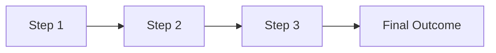
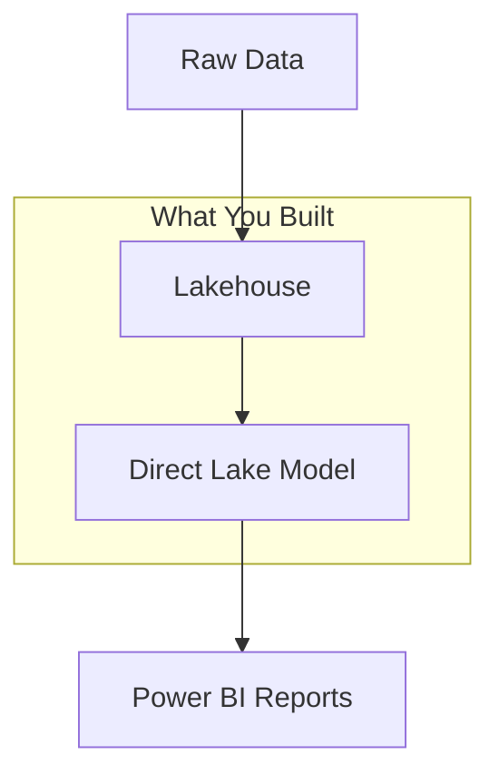

# Lab X: [Lab Title]

## Lab Overview

[Comprehensive introduction with key concepts, what students will build, and learning objectives]

### What You'll Build


### Key Concepts
- **Concept 1**: Brief explanation
- **Concept 2**: Brief explanation  
- **Concept 3**: Brief explanation

### Learning Objectives
By completing this lab, you'll be able to:
- ✅ Objective 1
- ✅ Objective 2
- ✅ Objective 3

**Estimated Time**: X minutes

---

## 1. Install Required Libraries
[Brief description - 1-2 sentences about what this step does]

```python
%pip install -q --disable-pip-version-check semantic-link-labs
```

## 2. Import Libraries and Set Variables  
[Brief description - 1-2 sentences about what this step does]

```python
import sempy_labs as labs
# ... other imports
```

## 3. Create Lakehouse
[Brief description - 1-2 sentences about what this step does]

```python
# lakehouse creation code
```

## 4. Load Sample Data
[Brief description - 1-2 sentences about what this step does]

**Tables being loaded:**
- Table 1 (description)
- Table 2 (description)

```python
# data loading code
```

## 5. Create Semantic Model
[Brief description - 1-2 sentences about what this step does]

```python
# model creation code
```

## 6. Add Relationships
[Brief description - 1-2 sentences about what this step does]

```python
# relationship code
```

## 7. Create Measures
[Brief description - 1-2 sentences about what this step does]

```python
# measures code
```

## 8. Test and Validate
[Brief description - 1-2 sentences about what this step does]

```python
# validation code
```

---

## Lab Summary

### What You Accomplished
In this lab, you successfully:
- ✅ [Key achievement 1]
- ✅ [Key achievement 2] 
- ✅ [Key achievement 3]

### Architecture Overview


### Key Takeaways
- **Performance**: [Key insight about performance]
- **Best Practices**: [Key best practice learned]
- **Next Steps**: [What comes next]

### Performance Results
- Query response: [X seconds improvement]
- Data freshness: [Real-time updates]
- Resource efficiency: [X% reduction in memory usage]

**Next Lab**: Continue to Lab [X+1] to learn about [next topic]

---
